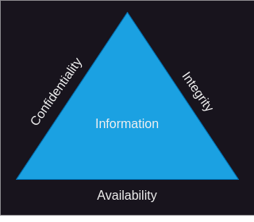

# Authorization

<!--toc:start-->

- [Authorization](#authorization)
  - [Theory](#theory)
  - [Implementation](#implementation)
    - [Simple authorization](#simple-authorization)
    - [Role-based authorization](#role-based-authorization)
    - [Resource-based Authorization](#resource-based-authorization)
  - [Limitations](#limitations)
  - [Conclusion](#conclusion)
  <!--toc:end-->

## Theory

Authentication on its own does not make a system secure.
When we authenticate a user it just means that verify their identity.

Identity is not part of the CIA-triad.



However, confidentiality and integrity is.
Both goals have to do with authorization.
To determine whether someone (or something) is authorized to do something, we
need to have established identity.

We need authentication to determine authorization.

- **Confidentiality** means information is not made available or disclosed to
  unauthorized individuals, entities, or processes.
- **Integrity** means that data cannot be modified in an unauthorized or
  undetected manner.

Authorization - put simply - is policies on who can do what.

There are many ways such policies can be implemented.
Here I will cover a couple techniques that are relatively simple to understand.
With these we are able to cover a broad spectrum of use-cases for distributed
systems.
The policies I will cover are:

- Simple authorization
- Role-based authorization
- Resource-based authorization

## Implementation

### Simple authorization

In lack of a better name.
It simply means to authorize access to an endpoint only for authenticated
users.
We also call unauthenticated users for anonymous users.

It works on an endpoint level.
Meaning actions in controllers.

There are two approaches to this.

- **Whitelist**
  - Deny anonymous users access to all endpoints.
  - Except when endpoints are explicitly marked with `[AllowAnonymous]`
- **Blacklist**
  - Allow anonymous users access to all endpoints.
  - Except when endpoints are explicitly marked with `[Authorize]`

We are less likely to accidentally violate the security goals if we deny by
default.
So we will go with the whitelist approach.

_Beware that most online resources with use the blacklist approach._

We need to tell ASP.NET framework to globally require that users are
authenticated to access any endpoints.

In `server/Api/Program.cs` you need to find the line that says
`builder.Services.AddAuthorization()` and replace it with this:

```cs
builder.Services.AddAuthorization(options =>
{
    options.FallbackPolicy = new AuthorizationPolicyBuilder()
        // Globally require users to be authenticated
        .RequireAuthenticatedUser()
        .Build();
});
```

Right above `app.MapControllers()` (towards the end of the file), make sure you
have:

```cs
app.UseAuthentication();
app.UseAuthorization();
```

_Yeah, I know it is already there, just good to verify for when you are adding
authorization to your own projects._

- Restart the server.
- Clear your browser data for localhost:5173 or open an Incognito window.
- Go to <http://localhost:5153> and you should see "HTTP ERROR 401" or "Error
  code: 401 Unauthorized", depending on your browser.

Now, anonymous users can't access anything at all on the back-end.
Not even the login endpoint.
Hey, wait that's a problem.
How can they login if they can't access the login endpoint?

We can override the new `RequireAuthenticatedUser` policy for select endpoints.
To do that, we add `[AllowAnonymous]` to the methods in our controllers.

In `server/Api/Controllers/AuthController.cs`, add `[AllowAnonymous]` to the
`Login` method.
It should look like this:

```cs
[HttpPost]
[Route("login")]
[AllowAnonymous]
public async Task<LoginResponse> Login(
  /* Truncated for brevity */
)
{
  /* Truncated for brevity */
}
```

Also add `[AllowAnonymous]` to `Register()` method in `AuthController`.

Restart the server and see if you can login again at
<http://localhost:5173/login>.

We also want anonymous users to be able to read blog posts (but not
comment).
So, we need to add `[AllowAnonymous]` attribute to a couple of more endpoints.
Those are `List()` and `Get()` in `server/Api/Controllers/BlogController.cs`.
Go ahead and add the attribute to those endpoints.

Try it out.
See if you can read a blog post without authentication by going to
<http://localhost:5173/post/1>.

  [ASP.NET documentation for Simple Authorization](https://learn.microsoft.com/en-us/aspnet/core/security/authorization/simple)

### Role-based authorization

It is often a requirement in systems that access to resources are restricted
based on role.

The blog application has multiple roles.
You can find them in `server/DataAccess/Role.cs`.

The application supports creating and updating drafts.
Where a draft is simply an unpublished blog post.

We don't want users with the "Reader" role to be able to access drafts.
That should be restricted to only "Admin" and "Editor" roles.
We can specify the allowed roles with the `[Authorize]` attribute.

Open `server/Api/Controllers/DraftController.cs` and add `[Authorize(Roles =
$"{Role.Admin},{Role.Editor}")]` to the class.
Should look like this:

```cs
[ApiController]
[Route("api/draft")]
[Authorize(Roles = $"{Role.Admin},{Role.Editor}")]
public class DraftController(IDraftService service) : ControllerBase
{
  /* Truncated for brevity */
}
```

> [!NOTE]
> The `Roles` parameter takes a sting with the roles to allow.
> Roles are separated by a comma.
> The code above use [string
> interpolation](https://learn.microsoft.com/en-us/dotnet/csharp/tutorials/string-interpolation)
> to construct the string from constants defined on the `Role` class.

Try it out.
Remember to restart the server first.

Login with "<reader@example.com>" see if you can access <http://localhost:5173/draft>.
Then login with "<admin@example.com>" or "<editor@example.com>" and see if you can
access the page.

Also.
Only the editor role should be allowed to create and update drafts.
So change the endpoints as shown:

```cs
[HttpPost]
[Route("")]
[Authorize(Roles = Role.Editor)]
public async Task<long> Create(DraftFormData data) => await service.Create(data);

[HttpPut]
[Route("{id}")]
[Authorize(Roles = Role.Editor)]
public async Task Update(long id, DraftFormData data) => await service.Update(id, data);
```

Restart server.
Login with "<admin@example.com>" and create a draft from
<http://localhost:5173/draft/create>.
You should see a message that says "Draft creation failed".
It means that the authorization policy works.

[ASP.NET documentation for Role-based Authorization](https://learn.microsoft.com/en-us/aspnet/core/security/authorization/roles)

### Resource-based Authorization

You will often need an authorization policy where access depends on the users'
relationship to a resource.
A resource can be a row in a database table.
And a relationship can be a foreign-key on that row.

In this application, we need a policy that says "only the author of a post is
allowed to update it".

The resource is a row in the `Posts` database table.
The relationship is `AuthorId` foreign-key column referencing the user that
created the post.


You can find the entity/model for it in
[Post.cs](../server/DataAccess/Entities/Post.cs).

To implement the policy, we need to make sure that `HttpContext.User` matches
`AuthorId` on the post before updating is allowed.

> [!NOTE]
> `HttpContext.User` is the server-side session we have for an authenticated
> user.

Navigate to `server/Api/Controllers/DraftController.cs` and change the `Update`
method to:

```cs
[HttpPut]
[Route("{id}")]
[Authorize(Roles = Role.Editor)]
public async Task Update(long id, DraftFormData data) =>
    await service.Update(HttpContext.User, id, data);
```

_Read ahead to fix the red line_

**Notice:** we added `HttpContext.User` as parameter to the service.

Then in `server/Api/Services/DraftService.cs` change the `Update` method in
`IDraftService` interface to:

```cs
Task Update(ClaimsPrincipal claims, long id, Requests.DraftFormData data);
```

Then in `DraftService`, change the implementation to:

```cs
public async Task Update(ClaimsPrincipal claims, long id, Requests.DraftFormData data)
{
    var currentUserId = claims.GetUserId();
    var post = _postRepository
        .Query()
        .Where(x => x.AuthorId == currentUserId)
        .Single(x => x.Id == id);
    post.Title = data.Title;
    post.Content = data.Content;
    post.UpdatedAt = DateTime.UtcNow;
    if (data.Publish ?? false)
    {
        post.PublishedAt = DateTime.UtcNow;
    }
    await _postRepository.Update(post);
}
```

> [!IMPORTANT]
> **Notice:** the `.Where(x => x.AuthorId == currentUserId)`.
> It makes sure that the post can only be updated if the author is the current
> user.

Now that we are at it.
We also need to change the `Create` method, so it adds `AuthorId` before
saving the post.

Open `server/Api/Controllers/DraftController.cs` and change the `Create`
method to:

```cs
[HttpPost]
[Route("")]
[Authorize(Roles = Role.Editor)]
public async Task<long> Create(DraftFormData data) =>
    await service.Create(HttpContext.User, data);
```

Then in `server/Api/Services/DraftService.cs`, change the `IDraftService` interface to:

```cs
Task<long> Create(ClaimsPrincipal claims, Requests.DraftFormData data);
```

Then `DraftSersvice` implementation to:

```cs
 public async Task<long> Create(ClaimsPrincipal claims, Requests.DraftFormData data)
 {
     var currentUserId = claims.GetUserId();
     var post = new Entities.Post
     {
         Title = data.Title,
         Content = data.Content,
         AuthorId = currentUserId,
         PublishedAt = data.Publish ?? false ? DateTime.UtcNow : null,
         CreatedAt = DateTime.UtcNow,
         UpdatedAt = DateTime.UtcNow,
     };
     await _postRepository.Add(post);
     return post.Id;
 }
```

> [!IMPORTANT]
> **Notice:** `var currentUserId = claims.GetUserId()` and `AuthorId =
> currentUserId`.
>
> We need to set an author when a draft is created, before the new update policy
> makes any sense.

Try it out!
Login with "<editor@example.com>", then go to <http://localhost:5173/draft> and
create a draft.
Then login with "<othereditor@example.com>" and see if you can edit it.

## Limitations

The authorization policies that have been implemented in the server should of
course also be reflected on the client.
A button shouldn't be shown only if the user isn't allowed to do the action.
The client app here doesn't fully mirror the authorization policies on the
server.
This doesn't do much harm regarding the security aspect of the system.
But it does hurt the user experience.

## Conclusion

For _Simple Authorization_ and _Role-based Authorization_ we decorated the
endpoints with the attributes `[AllowAnonymous]` and `[Authorize]`.
For _Resource-based Authorization_ we didn't use an attribute.
Instead, we implemented it in the service layer instead.
That is because we need to talk to the database to find the AuthorId.
I think it makes sense to implement it where we are already retrieving the
resource from the database.

It is actually also possible to implement _Resource-based Authorization_ with
attributes.
That is how the [ASP.NET documentation for resource-based
authorization](https://learn.microsoft.com/en-us/aspnet/core/security/authorization/resourcebased)
does it.
However, it involves more code and cost an extra round-trip to the database.

_Resource-based Authorization_ policies are many times overlooked, which
creates vulnerabilities.
So, getting these policies right is very important.
For instance: Imagine a banking system.
It would be terrible if every customer could just withdraw money from anyone's
account.
We need policies based on users (customer) relationship to a resource (bank
account).

As developers, we spend much effort on what users can do in our system.
It is just as important that we spend effort on rules for what the user can
**not** do.

There are many other ways that authorization policies can be implemented.
I believe that these 3 ways shown here, will cover many use-cases.

That said, you will learn other ways as mature in the profession.

[Reference solution](https://github.com/rpede/cds25-tutorial-auth/tree/02-authorization)
